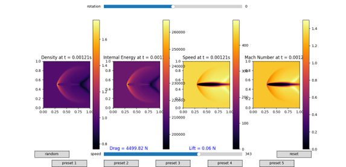

# READ ME
## BANG: BANG Aerodynamic Numerical Gigasim

## What is BANG?
BANG is a fluid-dynamics simulation made for a school project. It can simulate the flow of air around a wing and show the density, the internal energy and the speed in clear graphs.

## How to download
Find the github release page for BANG and download the correct BANG file (BANG.exe for windows and for linux BANG). After downloading the correct file launch the file and you'll be put straight into the simulation.

## How to operate BANG

In the above screenshot 